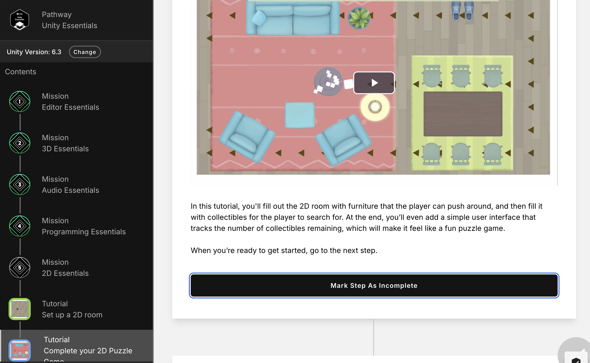

# Compte-rendu du 2 février 2026

## Tuto Unity

J'ai réalisé le début du tuto Unity Essentials :

- Maîtrise de l'interface et de la navigation 
- Gestion des objets et composants 
- Utilisation des Prefabs et Matériaux 
- Mise en place de l'environnement sonore 
- Introduction au Scripting C# 

## Image

